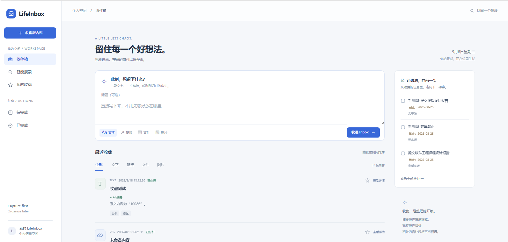
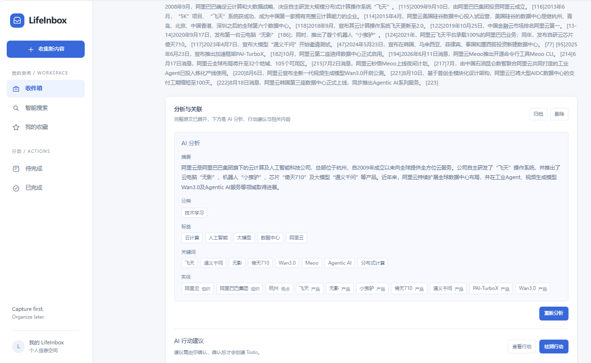
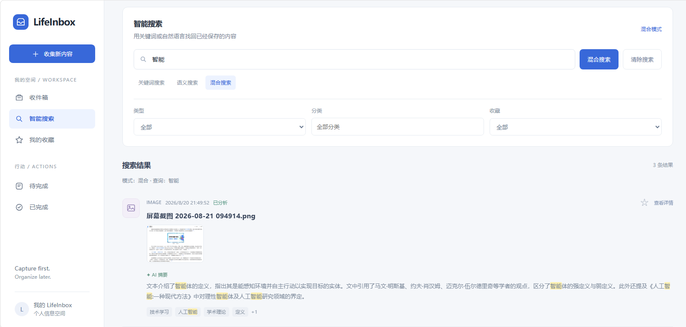
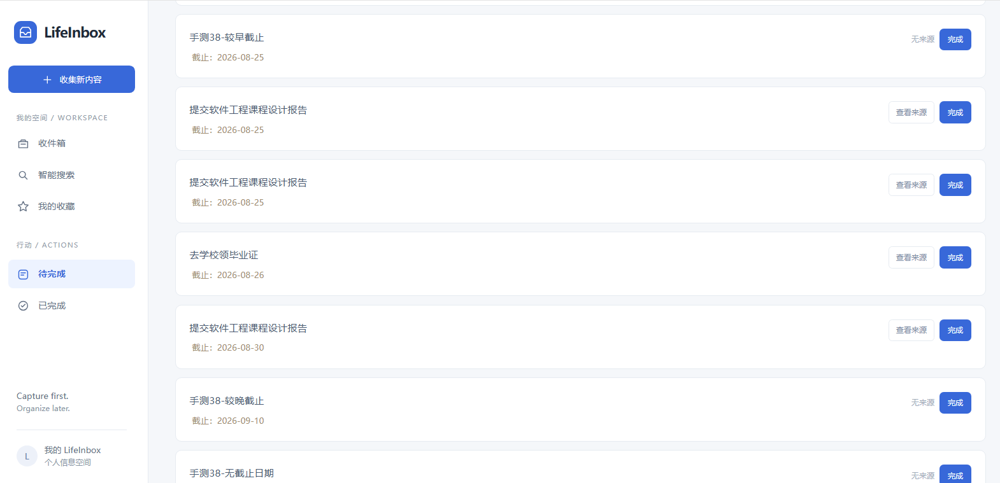
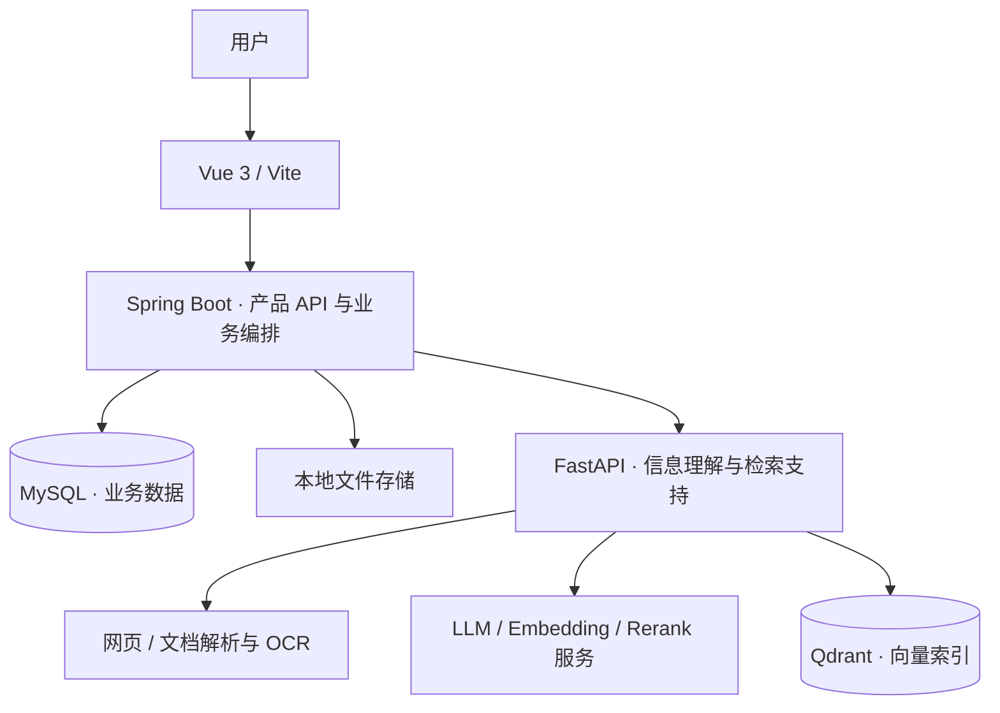

# LifeInbox · AI 个人信息收件箱

> 先收集，再整理。让保存的信息能够被找回、转化为行动，并发现彼此之间的联系。

## 界面预览

### 收件箱
统一保存文本、链接、文件和图片。



### AI 整理
自动生成摘要、分类和标签，方便后续查看。



### 智能搜索
通过自然语言查找已保存的内容。



### 待办管理
查看并管理从信息中确认的待办事项。



LifeInbox 是一个基于 **Java / Spring Boot + Vue + Python / FastAPI** 的个人信息管理项目。它将文本、网页、文件和图片统一保存到 Inbox，通过 AI 提取摘要与标签，结合关键词和向量检索找回内容，并将信息中的行动建议转化为用户确认的 Todo。

**当前已实现 V0.1–V0.5：统一收集、AI 整理、智能搜索、行动提取和关联发现。** Personal RAG、对话检索与 Agent 属于后续规划。

[功能概览](#功能概览) · [架构设计](#架构设计) · [关键实现](#关键实现) · [本地运行](#本地运行) · [项目文档](#项目文档)

## 为什么做这个项目

阅读文章、学习技术和处理日常事务时，有用的信息经常散落在网页、截图、文档和临时笔记中。保存时需要整理，过后又容易忘记关键词，藏在内容里的任务和截止日期也可能被遗漏。

LifeInbox 围绕这条使用路径展开：

```text
保存一段文字 / 网页 / 文件 / 图片
                 ↓
      提取正文，生成摘要、分类和标签
                 ↓
      用关键词或自然语言找回信息
                 ↓
      确认行动建议，形成可追溯的 Todo
                 ↓
      浏览与当前信息相关的其他内容
```

核心原则是 **Capture First, Organize Later**：原始信息先保存，AI 作为后续增强。模型、OCR 或向量服务失败，不应让一次已经成功的收集变成失败。

## 功能概览

| 模块 | 已实现能力 |
| --- | --- |
| 统一收集 | TEXT、URL、FILE、IMAGE 四类内容；Inbox 浏览、收藏、归档、删除和文件管理 |
| AI 整理 | 网页正文提取、TXT / Markdown / PDF 文本提取、图片 OCR；生成摘要、分类、标签、关键词和实体 |
| 智能搜索 | MySQL 关键词检索、Qdrant 语义检索、RRF 混合排序、可选模型重排、条件筛选与安全高亮 |
| 行动提取 | 识别待办与截止日期，保留原文证据；用户接受或忽略候选，接受后创建 Todo |
| Todo 管理 | 待办列表、完成与重新打开、截止日期展示，以及来源内容追溯 |
| 关联发现 | 基于已有向量召回候选，由 LLM 判断关联；保存关联关系，按需展示相关内容 |
| 处理恢复 | 独立 AI / Action / Relation 状态、失败重试、超时处理中任务接管，以及旧请求结果保护 |

例如，保存“请在 2026 年 9 月 20 日前提交课程设计报告”后，系统可以提取行动候选、截止日期与原文依据。用户确认后才创建 Todo；重复确认返回已有 Todo，避免重复任务。

## 架构设计



- **Java 管理产品与业务状态**：Inbox、Todo、用户决策、搜索编排、处理状态和最终结果落库。
- **Python 提供信息理解能力**：内容提取、结构化分析、行动提取、向量检索支持和关联判断，不连接 MySQL 管理业务数据。
- **MySQL 是业务数据来源**：Qdrant 保存可重建的派生检索索引，检索候选需要回到 MySQL 校验当前业务状态。
- **前端统一访问 Java API**：无需直接接入模型服务或向量数据库。

### 技术栈

| 层次 | 技术 |
| --- | --- |
| 前端 | Vue 3.5、Vite 8、JavaScript |
| 后端 | Java 21、Spring Boot 4.1、MyBatis-Plus 3.5、MySQL |
| AI 服务 | Python 3.11+、FastAPI、Pydantic、HTTPX |
| 内容处理 | Beautiful Soup、pypdf、RapidOCR / ONNX Runtime |
| 检索 | Qdrant、Embedding、RRF、可选 Rerank |
| 验证工具 | Spring Boot Test、pytest、Node.js 内置测试运行器 |

具体依赖以 [pom.xml](server/pom.xml)、[pyproject.toml](ai-engine/pyproject.toml) 和 [package.json](web/package.json) 为准。

## 关键实现

### 1. 先提交业务数据，再执行 AI 任务

收集数据的事务提交后，通过 `AFTER_COMMIT` 事件触发已启用的自动处理。有界线程池限制后台任务数量，避免模型请求持续堆积。外部 HTTP、LLM 和向量操作放在数据库事务之外，结果写入使用短事务。

AI、Action、Relation 分别维护处理状态与 UUID Attempt ID。任务完成时校验处理权，避免旧请求在超时接管后覆盖新结果；对长期停留在 `PROCESSING` 的任务提供恢复入口。

代码入口：[自动分析监听器](server/src/main/java/com/lifeinbox/server/service/InboxAutoAnalyzeListener.java)、[后台线程池](server/src/main/java/com/lifeinbox/server/config/AiBackgroundConfiguration.java)、[分析结果持久化](server/src/main/java/com/lifeinbox/server/service/InboxAnalysisPersistenceService.java)。

### 2. 混合检索与分层降级

关键词检索覆盖原始内容及 AI 派生字段；语义检索通过 Query Embedding 从 Qdrant 召回候选，Java 再根据 MySQL 中的记录进行过滤与组装。

```text
关键词检索 ───────────────┐
                        ├─ RRF 排名融合 ─ 可选 Rerank ─ 搜索结果
Query Embedding → Qdrant ┘
```

RRF 使用排名贡献 `1 / (60 + rank)` 融合两路结果，避免直接混加不同含义的检索分数。在混合搜索中，语义分支失败可退回关键词结果，重排失败则保留 RRF 排序。

代码入口：[搜索 API](server/src/main/java/com/lifeinbox/server/controller/SearchController.java)、[RRF 融合](server/src/main/java/com/lifeinbox/server/service/HybridSearchFusion.java)。

### 3. AI 建议与用户决策分离

模型返回结构化行动候选，Python 校验字段、原文证据与日期表达。相对日期使用来源内容的创建日期作为稳定参考；缺乏依据的日期保持未确定，不凭空补全年份或具体时间。

用户接受候选时，Java 在同一个事务内创建 Todo 并更新候选状态，通过行锁与来源唯一约束防止重复创建。后续 AI 处理不能覆盖用户已经确认的业务决策。

代码入口：[候选确认与忽略](server/src/main/java/com/lifeinbox/server/service/ActionCandidateDecisionService.java)、[日期标准化](ai-engine/app/services/deadline_normalizer.py)。

### 4. 有界关联发现与幂等持久化

关联发现复用源内容已有的 Qdrant 向量，最多选择 20 个候选，经 MySQL 过滤后交给 LLM 批量判断，避免对所有内容做两两比较。源文本、候选文本和返回 ID 都有边界校验。

关系使用 MySQL `content_relation` 表存储，仅支持对称的 `RELATED_TO`。写入时规范化 ID 顺序，以唯一约束避免重复；重新发现采用追加方式，空结果或模型失败不会删除已有关系。

前端只在展开内容时加载关联列表；读取关联不触发模型调用。自动发现仅在向量成功写入后对未处理项执行，另提供显式重试、重新发现与有界历史补处理接口。

代码入口：[关联处理编排](server/src/main/java/com/lifeinbox/server/service/RelationProcessingService.java)、[关联持久化](server/src/main/java/com/lifeinbox/server/service/RelationDiscoveryPersistenceService.java)、[关联内容面板](web/src/components/RelatedItemsPanel.vue)。

## 本地运行

以下命令使用 **PowerShell**，从仓库根目录执行；长时间运行的服务分别使用独立终端。

### 环境要求

- Java 21、MySQL 8.x。
- Node.js 22.12+、npm。
- Python 3.11+、uv。
- 体验语义检索和关联发现时，需要 Qdrant 与可用的 Embedding 服务。
- 体验 AI 分析和行动提取时，需要兼容当前客户端接口的模型服务配置。

### 1. 初始化数据库

全新数据库使用 [V0.5 Schema](docs/sql/v0.5-schema.sql)。在仓库根目录打开 MySQL 客户端：

```powershell
mysql -u root -p
```

然后在 MySQL 客户端中执行：

```sql
SOURCE docs/sql/v0.5-schema.sql;
```

已有数据库应先备份并按版本执行增量迁移，不要重复执行全新安装脚本；详见 [数据库文档](docs/database.md)。

### 2. 启动 Java 后端

```powershell
cd server
$env:MYSQL_PASSWORD="<你的本地数据库密码>"
.\mvnw.cmd spring-boot:run
```

默认连接 `localhost:3306/life_inbox`，用户名为 `root`，HTTP 端口为 `8080`。自定义数据库连接可通过 `SPRING_DATASOURCE_URL` 和 `SPRING_DATASOURCE_USERNAME` 覆盖。

仅体验基础收集时，可以暂不启动 AI 服务。若也希望关闭默认开启的行动提取和关联后台处理，在启动 Java 前设置：

```powershell
$env:LIFEINBOX_ACTION_AUTO_EXTRACT_ENABLED="false"
$env:LIFEINBOX_RELATION_AUTO_DISCOVER_ENABLED="false"
```

### 3. 启动前端

```powershell
cd web
npm ci
npm run dev
```

访问终端显示的地址，通常为 [http://localhost:5173](http://localhost:5173)。开发代理默认将 `/api` 转发到 `http://localhost:8080`，可用 `VITE_API_TARGET` 覆盖。

### 4. 启用 AI 能力

在新的终端中配置并启动 Python 服务：

```powershell
cd ai-engine
uv sync
$env:LIFEINBOX_LLM_API_KEY="<你的 API Key>"
$env:LIFEINBOX_LLM_MODEL="<模型名称>"
$env:LIFEINBOX_LLM_BASE_URL="<模型服务的兼容接口基础地址>"
uv run uvicorn app.main:app --host 127.0.0.1 --port 8000
```

可通过 [健康检查](http://localhost:8000/health) 查看服务状态。基础地址由客户端追加 `/chat/completions`；模型配置需与服务提供方一致。

**自动 Analyze 默认关闭**，可以先在页面手动分析。若需要保存后自动分析，在 Java 终端设置以下变量后重启后端：

```powershell
$env:LIFEINBOX_AI_AUTO_ANALYZE_ENABLED="true"
```

配置示例见 [ai-engine/.env.example](ai-engine/.env.example)。当前应用不会自动读取 `.env` 文件，需要通过环境变量注入；不要将真实密钥写入代码或示例文件。

### 5. 启用向量检索与重排（可选）

准备可访问的 Qdrant 实例后，在 Python 终端中追加配置并重启 AI 服务：

```powershell
$env:LIFEINBOX_EMBEDDING_MODEL="<Embedding 模型名称>"
$env:LIFEINBOX_VECTOR_STORE_ENABLED="true"
$env:LIFEINBOX_QDRANT_URL="http://127.0.0.1:6333"
```

Embedding 使用 `LIFEINBOX_LLM_BASE_URL` 下的 `/embeddings`，并复用模型 API Key。已有内容只有在向量索引成功建立后才能参与相应的语义检索与关联发现。

可选重排需要在 Python 侧设置 `LIFEINBOX_RERANK_MODEL`、`LIFEINBOX_RERANK_BASE_URL`，并在 Java 侧设置 `LIFEINBOX_RERANK_ENABLED=true`，重启对应服务后生效。Provider 接口要求、Qdrant 配置和模型兼容细节见 [AI Engine 文档](ai-engine/README.md)。

### 功能开关默认值

| 环境变量 | 所属进程 | 默认值 | 作用 |
| --- | --- | --- | --- |
| `LIFEINBOX_AI_AUTO_ANALYZE_ENABLED` | Java | `false` | 收集后自动分析 |
| `LIFEINBOX_ACTION_AUTO_EXTRACT_ENABLED` | Java | `true` | 可用正文提交后自动提取行动 |
| `LIFEINBOX_RELATION_AUTO_DISCOVER_ENABLED` | Java | `true` | 向量成功写入后首次发现关联 |
| `LIFEINBOX_RERANK_ENABLED` | Java | `false` | 混合搜索启用重排 |
| `LIFEINBOX_VECTOR_STORE_ENABLED` | Python | `false` | 启用 Qdrant 向量存储能力 |

## 目录结构

```text
life-inbox/
├── web/                 Vue 前端与前端测试
├── server/              Spring Boot 产品 API、业务服务与测试
├── ai-engine/           FastAPI、解析 / OCR、模型客户端与测试
├── docs/
│   ├── architecture.md  架构与职责边界
│   ├── api.md           API 契约
│   ├── database.md      数据模型与迁移说明
│   ├── sql/             全新安装 Schema 与增量迁移
│   ├── manual-acceptance.md
│   ├── roadmap.md       版本规划
│   └── history/         分阶段开发记录
└── README.md
```

## 测试与验证

在对应模块目录运行：

| 模块 | 命令 | 验证内容 |
| --- | --- | --- |
| Java | `.\mvnw.cmd clean test` | 业务服务、接口、状态流转、幂等与持久化契约 |
| Python | `uv run pytest -p no:cacheprovider` | 内容解析、结构化输出、日期处理与检索服务等 |
| 前端 | `npm test` | API 封装、状态处理、安全高亮等 |
| 前端构建 | `npm run build` | Vite 生产构建 |

自动化测试之外，真实模型、MySQL、Qdrant 与浏览器的联调步骤见 [手动验收清单](docs/manual-acceptance.md)。

## 当前边界与后续计划

项目当前面向个人使用和本地运行。尚未提供完整的多用户认证与权限隔离，不应直接作为公共服务开放业务接口。

网页提取不执行 JavaScript；文件分析目前支持 TXT、Markdown 和可提取文本的 PDF，扫描 PDF 不会自动进入整篇 OCR 流程。解析效果、模型响应与关联结果取决于输入内容和所配置的服务。

| 版本 | 目标 | 状态 |
| --- | --- | --- |
| V0.1 · Universal Inbox | 统一保存各类信息 | 已实现 |
| V0.2 · AI Organizer | 自动理解与整理 | 已实现 |
| V0.3 · Smart Search | 关键词、语义与混合检索 | 已实现 |
| V0.4 · Action Extractor | 行动建议与用户确认的 Todo | 已实现 |
| V0.5 · Relations | 有界关联发现、持久化与浏览 | 已实现 |
| V1.0 · Personal AI | Personal RAG、对话检索与个人信息分析 | 规划中 |

浏览器扩展、提醒调度、日历集成与 Agent 执行尚未实现。关联历史补处理与重新发现需要显式触发，目前没有定时重新发现或自动向量修复。

## 项目文档

- [架构设计](docs/architecture.md)：模块边界与处理流程。
- [API 文档](docs/api.md)：接口、请求响应与错误处理。
- [数据库设计](docs/database.md)：业务表、约束与版本迁移。
- [AI Engine](ai-engine/README.md)：模型配置、解析能力和内部接口。
- [手动验收](docs/manual-acceptance.md)：功能链路与失败场景验证。
- [路线图](docs/roadmap.md)：已实现版本与后续演进方向。
